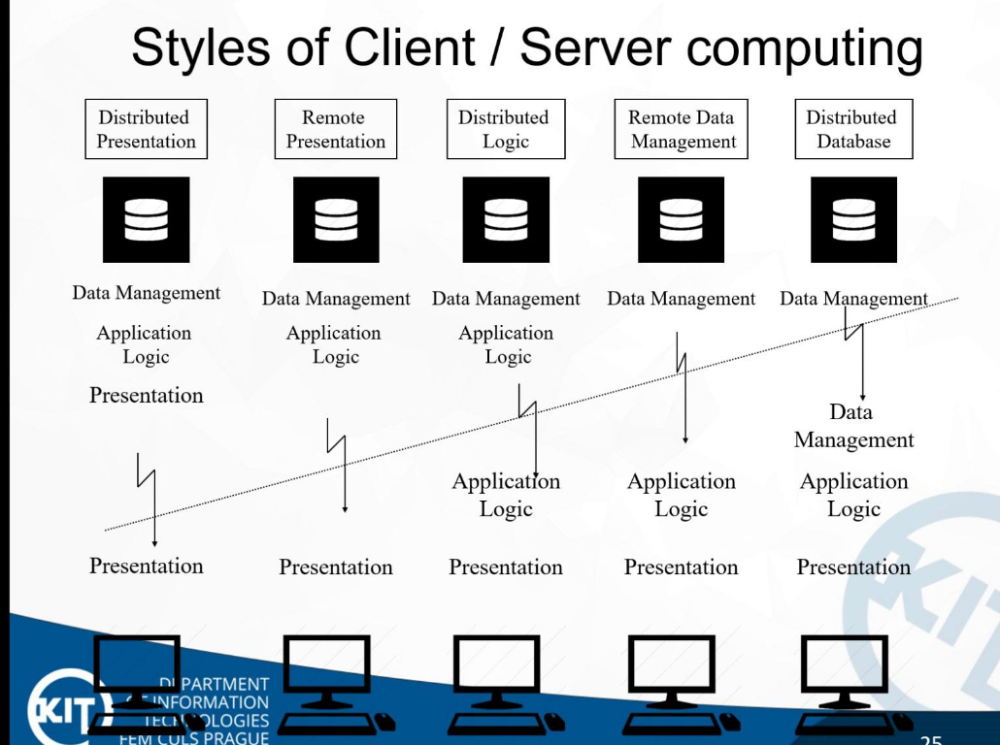

## 1. Overveiw
Batch processing
* Пользователь создает batch (какой-то набор данных и кода (возможно)) и закидывает его на сервер. Сервер потом, в порядке очереди, запустит твой batch.
* Используется в Remote Job Entry (RJE) и в Autonomous agents (bots).
* Суперкомпютер является примером batch processing.

## 2. Network services.
**Data** - without meaning 
**Information** - with meaning  

### Covarage types
**BAN/PAN** - personal networks. Headset and phone by bluetooth. 
**LAN** - local networks. Shared across familiar people (room, building). 
**CAM** - campus 
**MAN** - metropolitan (City). Different not familiar users. 
**WAN** - wide-area (all larger sizes). 
**VPN** - virtual network 

***
## 3. Computer models

## 3.1 Batching
**mainframe** - very powrefull computer. 
**Terminal** - is not a computer.  
! terminal network is not regular network. It's only I/O operations. 
|Pros|Cons|
|--|--|
|Fast connection|No or limited graphic interface|
|Only text is transmitted|Need for command line skills|
|Easier maintanance||
***
### 3.2 File server/workstation
**File server/work station scheme** - this system pretends that we have common files on our workstation as local, but they actualy are stored on a fileserver. 
There are problems with sharing a file. Can be solved: 
- Last change override previous.
- Locks on a file.

There is one more problem. We should read all big file to work with it and then upload it again to the file server.
***
### 3.3 Client/server model

**peer-to-peer network** - each node can work as client and server at the same time.

**Three-layer C/S model** 
The problem is that different client have different OS and even devices. 
How to handle? 
- Make an agreement to use only single OS type with last version.
- Virtual environment (like JVM with java).
- Existing platform-dependent applicaiton with a general standardized interface (browsers).

**cloud solution**
***
