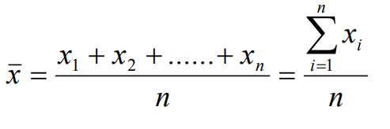
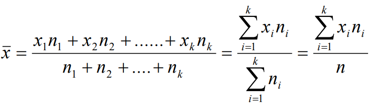

## 1. Intro
Статистика работает по принципу: собери информацию, отсортируй, сделай выводы.

Процесс статистики:
- Определи цель исследования: сформируй конкретный вопрос.
	- **Population** - группа чего-либо которую исследуют.
	- **Sample** - подмножество популяции.
	- **Individual** - один из группы.
- Собери информацию
- Систематизируй и обобщи информацию.
	- Также этот процесс называется Descriptive statistic. Она описывает собраную инфу через цифры, графы и таблички.
	- Главная задача Descriptive statistic дать обзор собраной информации.
- Сделать вывод.

Различия в качественных и количественных переменных.
- **qualitative** - переменные, которые являются атрибутом отдельного individual.
- **quantitative** - цифры, которые при арифметических операциях сохраняют значимость. Можно плюсовать температуру, но нельзя плюсовать Zip коды.
	- **discrete** - имеют ограницений набор значений или их можно пронумеровать. Если значение посчитали
	- **continuous** - все что не попадает в дискретные. Если значение измерили.

## 2. Basic summarizing and graphing data

Важными параметрами Set есть:
- **Center** 		- среднее значение.
- **Variation** 	- мера того, насколько данные отличаются друг от друга.
- **Distribution** 	- форма распределения выборки (как колокол)
- **Outliers** 		- sample values которые довольно далеко от основной массы других

Frequency distributions - какая-то полезная табличка:

Если значения continuous, то нужно разбить на интервалы (классы) 
k ~= sqrt(n)  
k - количество интевалов  
n - количество измерений  
h = max-min/k (h - ширина интервала)  

## 3. Descriptive statistics.

**Mean (-x)** - среднее значение set. 
Можно посчитать двумя способами: 

**Non-weighted: (individual)** 
 
 
**Weighted: (grouped)**
 

**Median (~x)** - mean is bad cause it can be changed by single abnormal value. So... use mediane
{5,7,9,9,123} - 9 is the mediane. Sort and select the middle value.
{1,2,2,4,5,7} - 2+4/2=3. 3 is the median.

**Mode (^x)** - the value that occurs most frequently.
- When two values occur with the same greatest frequency, each one is a mode and the data set is bimodal
- When more than two values occur with the same greatest frequency, each is a mode and the data set is multimodal.
- When no value is repeated, there is no mode. 

### 3.2 Measure of variation
Тяжело понять какая выборка по Mean, Median или Mode. Поэтому есть еще показатели: 
**Range** - x(max)-x(min)=R  
**Variance (Дисперсия)** - самая популярная это $s^2$;
- Non-weighted form: $s^2$=$\sum_{i=1}^{n} (x_i-\bar{x})^2/(n-1)$
- Weighted form: $s^2=\sum_{i=1}^n(x_i-\bar{x})^2*n_i/(n-1)$ 

**Standard deviation** - $s=\sqrt{s^2}=\sqrt{\sum_{i=1}^{n} (x_i-\bar{x})^2/(n-1)}$ - avarage deviation from a mean 
Notes about variance and standard deviation:
- variance is expressed without unit of measure;
- standard deviation is expressed in the same unit of measure as the observed variable;
- the size of the variance (standard deviation) is related to the variability (изменчивость) in the values.
	- the more homogeneous values - the smaller variance (standard deviation).
	- the heterogeneous values, the larger variance (standard deviation).

**Coefficient of variation** - expresses relative dispersion. Values higher than 0.5 indicate very large variability.
- v = $s/\bar{x}$

### 3.3 Exploratory data analysis.
**Five-number summary** -  это data set, который состоит из:
$x_{min} < \bar{x}_{0.25} < \bar{x} (mediane) < \bar{x}_{0.75} < x_{max}$

**Quartiles** - $\bar{x}_{0.25}$ - 25% значений всей выборки будет меньше чем $\bar{x}_{0.25}$ и остальные 75% будут больше чем.

**Interquartile (IQR)** - Измеряет разброс между первым и третьим квартилем: 
IQR =  $\bar{x}_{0.75} - \bar{x}_{0.25}$ 

**Outliers** - Individuals that is located very far away from almost all of the other. 
Outlier is:
- value below $\bar{x}_{0.25}$ by more than 1.5 * IQR
- value above $\bar{x}_{0.75}$ by more than 1.5 * IQR

